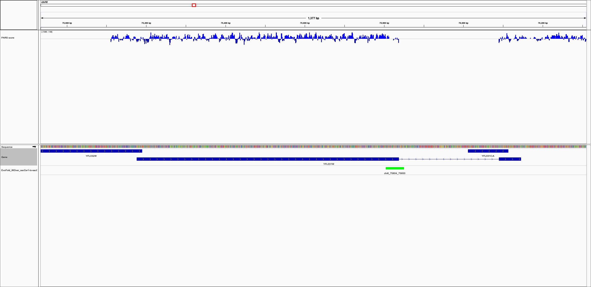
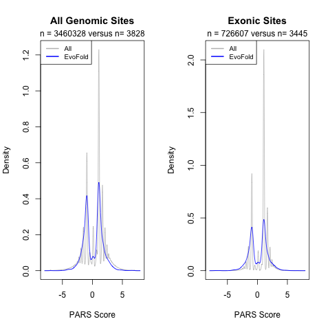

After creating the original repository, I learned about the study of [Kertesz et al. 2010](https://www.ncbi.nlm.nih.gov/pubmed/20811459).

So, I was curious if I could high higher scores for within the EvoFold fRNA predictions (versus the rest of the coding regions)

**1)** I converted the EvoFold annotations from sacCer1 to sacCer2 using the web-based [UCSC liftOver](https://genome.ucsc.edu/cgi-bin/hgLiftOver)

**2)** Convert [GSE22393](https://www.ncbi.nlm.nih.gov/geo/query/acc.cgi?acc=GSE22393) .wig file to .bed file using [bedOps wig2bed](https://bedops.readthedocs.io/en/latest/content/reference/file-management/conversion/wig2bed.html)

```
wig2bed < GSE22393_processed_merged_PARS_sacCer2_1.wig > GSE22393_processed_merged_PARS_sacCer2_1.bed
```

I was not exactly sure what to expect, but the higher PARS score does seem to be extended into the HAC1 fold that I described as the positive control in the [Warden et al. 2008](https://journals.plos.org/plosone/article?id=10.1371/journal.pone.0001559) paper (visualized using [IGV](https://software.broadinstitute.org/software/igv/))



**3)** Then, I used an R script (`compare_predictions.R`) to create a plot to compare scores:

The gene/transcript/exon annotation file came from the [Supplemental Website](https://genie.weizmann.ac.il/pubs/PARS10/pars10_catalogs.html) for the paper.



Perhaps this means I should try looking at the intronic / intergenic portions of partially overlapping exonic EvoFold fold (like for HAC1).  However, I am not currently certain what to think of these density plots (except that they look similar with or without filtering for EvoFold overlap).
